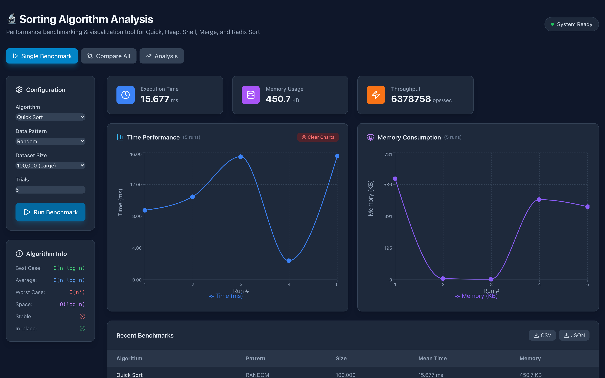
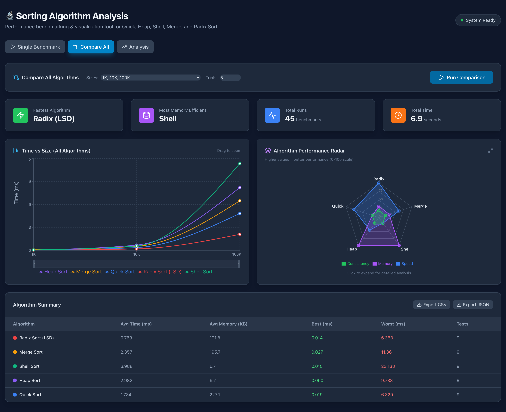
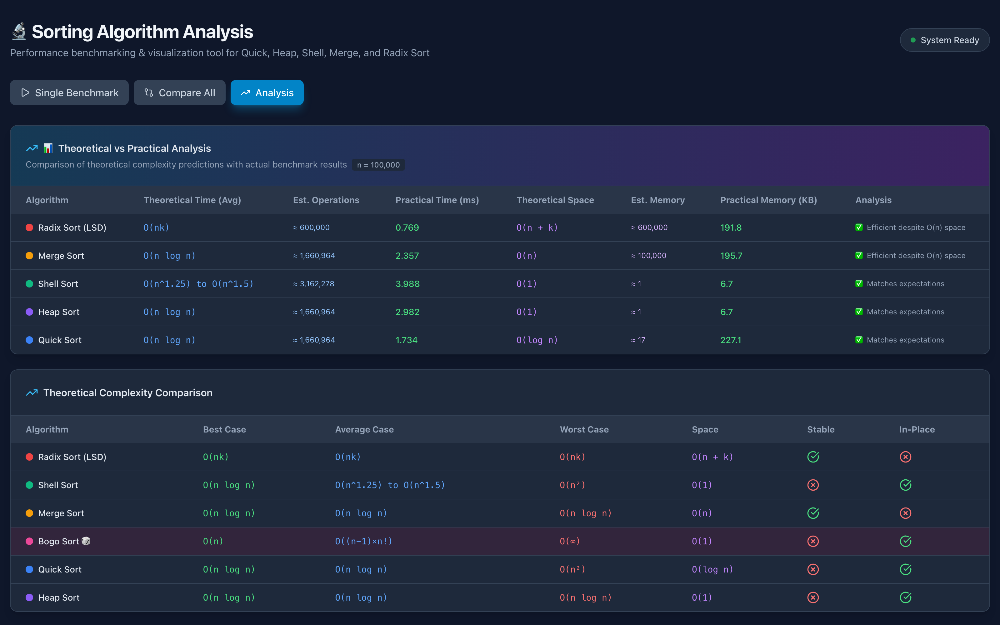

# Sorting Algorithm Performance Analysis

<p align="center">
	<a href="https://github.com/Urthella/algortihm-test-sim/actions/workflows/ci.yml"></a>
	
	
	
	<a href="LICENSE"></a>
</p>

A Java/Spring Boot + React application for benchmarking and comparing sorting algorithms: run controlled experiments across data patterns and sizes, then explore timing, memory, and complexity results in interactive charts.

## 📸 Demo

### Single Benchmark
Pick an algorithm, data pattern, dataset size, and trial count — get timing statistics, memory usage, throughput, and a run history:



### Compare All
Benchmark every algorithm across all patterns and sizes in one click, with summary cards and interactive charts:



### Analysis
See how theoretical Big-O predictions line up with the measured results:



## 📊 Algorithms

| Algorithm | Best | Average | Worst | Space | Stable |
|-----------|------|---------|-------|-------|--------|
| Quick Sort | O(n log n) | O(n log n) | O(n²) | O(log n) | No |
| Heap Sort | O(n log n) | O(n log n) | O(n log n) | O(1) | No |
| Shell Sort | O(n log n) | O(n^1.25) | O(n²) | O(1) | No |
| Merge Sort | O(n log n) | O(n log n) | O(n log n) | O(n) | Yes |
| Radix Sort (LSD) | O(nk) | O(nk) | O(nk) | O(n+k) | Yes |

Radix Sort handles negative integers too (sign-bit remapping on the most significant byte). There is also a hidden guest: **Bogo Sort 🎲** — available in Single Benchmark mode for entertainment purposes, excluded from batch comparisons for obvious O((n-1)×n!) reasons.

## 🚀 Quick Start

### Backend (Spring Boot)
```bash
./mvnw spring-boot:run        # Windows: mvnw.cmd spring-boot:run
```
API runs at: http://localhost:8080

### Frontend (React + Vite)
```bash
cd frontend
npm install
npm run dev
```
UI runs at: http://localhost:5173

## 🎯 Features

- **Time measurements**: mean, standard deviation, best and worst across trials, with a JIT warm-up run
- **Memory tracking**: approximate heap usage per algorithm, measured separately from timing
- **Data patterns**: Random, Partially Sorted (10% disorder), Reverse Sorted
- **Dataset sizes**: 1K – 500K elements (custom sizes via API, up to 1M)
- **Interactive charts**: line, bar, and radar comparisons (Recharts)
- **Complexity reference**: theoretical Big-O info side by side with measured results
- **CSV/JSON export** of benchmark results
- **Input validation**: out-of-range sizes/trials and unknown algorithms return HTTP 400 with a clear error message

## 🔌 API Endpoints

```
GET  /api/algorithms                  - List algorithms
GET  /api/patterns                    - List data patterns
GET  /api/algorithms/complexity       - Complexity info for all algorithms
GET  /api/algorithms/{name}/complexity - Complexity info for one algorithm
POST /api/benchmark                   - Run single benchmark
POST /api/benchmark/compare           - Run full comparison
```

Limits: `size` 1 – 1,000,000 · `trials` 1 – 50. See [REQUIREMENTS.md](REQUIREMENTS.md) for request examples.

## 📁 Project Structure

```
├── src/main/java/com/algoproject/
│   ├── algorithms/      # QuickSort, HeapSort, ShellSort, MergeSort, RadixSort (+BogoSort)
│   ├── bench/           # BenchmarkRunner
│   ├── controller/      # REST API + error handling
│   ├── data/            # DataGenerator
│   ├── dto/             # Request/Response DTOs
│   ├── model/           # BenchmarkResult, ComplexityInfo, DataPattern
│   ├── service/         # BenchmarkService (validation + orchestration)
│   └── util/            # Stats, MemoryUtil, ResultsExporter
├── src/test/java/       # Unit tests (algorithms + service)
├── frontend/            # React application
├── docs/                # Screenshots, sample results, project docs
└── REQUIREMENTS.md      # Full setup guide
```

## 🧪 Testing

```bash
./mvnw test              # Windows: mvnw.cmd test
```

35 tests cover correctness, edge cases (empty, single, duplicates, extreme values including `Integer.MIN_VALUE`), all data patterns, size variations, mixed-sign data, and API request validation. Every push and pull request also runs the full suite plus the frontend lint/build through [GitHub Actions](https://github.com/Urthella/algortihm-test-sim/actions).

A sample result set is available at [docs/benchmark-results-2026-01-04.json](docs/benchmark-results-2026-01-04.json).

## 🎓 Course Project

Algorithms Course Term Project: Performance Analysis of Sorting Algorithms.

## 🤝 Contributing

Contributions, bug reports, and feature requests are welcome! Please open an [issue](https://github.com/Urthella/algortihm-test-sim/issues) or submit a [pull request](https://github.com/Urthella/algortihm-test-sim/pulls).

## 📄 License

MIT — see [LICENSE](LICENSE).

## 👥 Authors

- [Utku Demirtaş](https://github.com/Urthella)
- [Furkan Karafil](https://github.com/thefcan)
